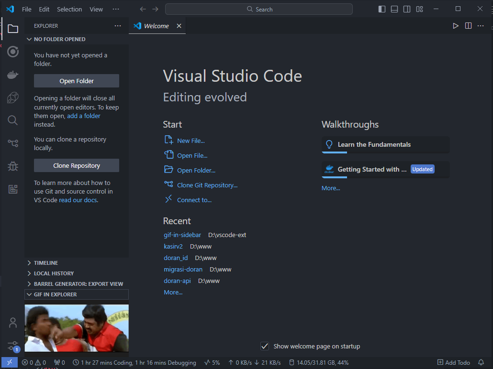

# GIF-in-Explorer Extension for VS Code

This Visual Studio Code extension allows you to display GIFs within the editor, either in a dedicated sidebar view or in a webview panel. It's a lightweight and fun way to integrate visuals into your development workflow!

## Features

- **Sidebar GIF Viewer:** View a GIF in a custom sidebar panel.
- **Webview Panel Support (Commented):** Option to open GIFs in a resizable, standalone webview (code available but commented out).

## Installation

1. Clone this repository or download the source files.
2. Open the project folder in Visual Studio Code.
3. Run `npm install` to install dependencies.
4. Press `F5` to launch an Extension Development Host.

## Usage

### Sidebar GIF Viewer

1. The extension registers a custom webview in the sidebar.
2. This webview automatically displays an example GIF located at `media/example.gif`.

### Webview Panel (Optional)

To enable standalone webview panels, uncomment the `openWebview` command in the source code. This allows you to open a webview panel by executing the `gifExplorerView.open` command.

## Development

### Project Structure

- **`src/extension.ts`:** The main entry point for the extension.
- **`media/example.gif`:** The default GIF displayed in the viewer.

### Adding Custom GIFs

To use your own GIFs:

1. Replace the `media/example.gif` file with your own.
2. Ensure the path in the `getHtmlForWebview` function matches your new file's location.

### Running the Extension

1. Open the project in VS Code.
2. Press `F5` to start the Extension Development Host.
3. The sidebar panel should load automatically.

## API

The extension registers the following:

- **View Provider:** `gifInSidebarView` – Adds a custom sidebar panel for displaying GIFs.
- **Command (Optional):** `gifExplorerView.open` – Opens a standalone webview panel.

## License

This project is licensed under the MIT License. See the [LICENSE](LICENSE) file for details.

## Contributing

Contributions are welcome! Feel free to fork this repository, create a branch, and submit a pull request.

---

Enjoy displaying your favorite GIFs in VS Code!
