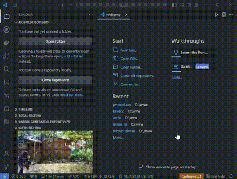

# GIF-in-Sidebar Extension for VS Code

This extension lets you display GIFs in a custom sidebar within Visual Studio Code, either from a local file or a URL.

https://marketplace.visualstudio.com/items?itemName=AdhaBakhtiar.gif-in-explorer

## Features

- **GIF Viewer in Sidebar**: Displays GIFs directly in a dedicated sidebar panel.
- **Load from File or URL**: Supports GIFs from local files or remote URLs.
- **Commands**:
  - **Select GIF**: Pick a GIF from your local files.
  - **Set GIF URL**: Enter a URL to display a GIF from the web.

## Usage

1. Open the command palette (`Ctrl+Shift+P` or `Cmd+Shift+P`) and use:
   - **`GIF in Sidebar: Select GIF`** to choose a local GIF file.
   - **`GIF in Sidebar: Set GIF URL`** to specify a URL for a GIF.
2. The selected GIF will appear in the sidebar panel.
3. To reset or change the GIF, run the commands again.

---

Enjoy customizing your workspace with your favorite GIFs!
